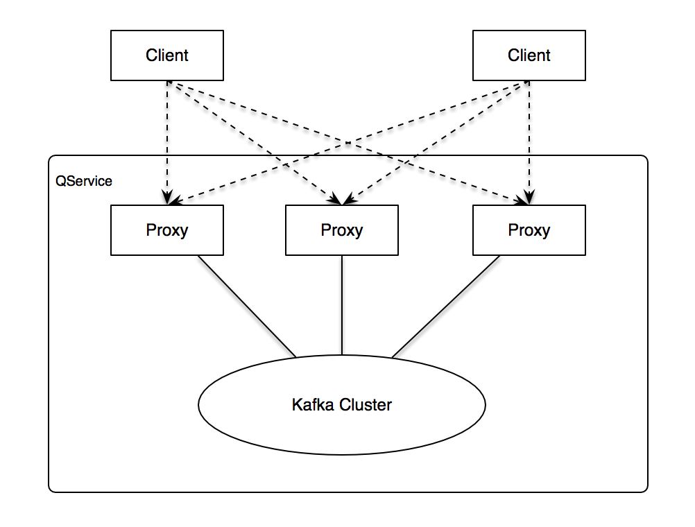

# QService
***一个更快更可靠的消息系统.***

## 特性
  - [x] [多协议支持](#多协议支持)
    - [x] [ASCII Memcached协议](#memcached-协议)
    - [x] [HTTP协议](#http-协议)
    - [ ] Redis协议
    - [ ] Motan协议
  - [x] [消息持久化](#持久化)
  - [x] [高可靠性](#可靠性)
  - [x] [多次消费](#多次消费)
  - [x] [至少投递一次](#至少投递一次)
  - [x] [Ack机制](#ack机制)
  - [ ] [多IDC支持](#多idc支持)
  - [x] [分布式](#分布式)
  - [x] [运维友好](#运维友好)
    - [x] [支持横向扩展、纵向扩展](#轻松扩容)
    - [x] [提供管理API、GUI](#提供管理gui)
    - [x] [提供监控API、GUI](#提供管理gui)

## 设计
  - QService是采用[Golang](https://github.com/golang/go)实现的一款分布式消息队列系统。
  - 采用[Zookeeper](https://zookeeper.apache.org)来存储系统元数据。
  - 后端采用[Kafka0.9](https://kafka.apache.org)集群作为消息持久化引擎。
  - 架构如图所示:
  

## 角色 概念
  - QService以queue为维度进行消息路由。每个proxy实例上看到的同一名称queue都是等价的。
  - QService以group为维度区分消费者。会为每个group维护一份消费记录。每个group都能得到一份queue的全量消息。
  - 简单来说，就是一个queue+group来唯一标识一个消费者。当你需要重复消费同一queue时，可以以不同的group来进行消费。

## 多协议支持
### Memcached 协议
  - 详见[Memcached API](memcached_cn.md)

### HTTP 协议
  - 详见[HTTP API](http_cn.md)

## 持久化
  - QService采用Kafka作为消息持久化引擎。
  - QService的proxy采用同步写(同步等级:WaitLocal)，确保消息写入Kafka Topic的Leader的本地磁盘后再给用户返回写结果。这样就保证了，每一条消息确实写入了Kafka集群。

## 可靠性
  - QService采用Kafka作为消息持久化引擎，因此以Kafka的持久化、多副本特性作为QService可靠性的保障。
  - 当有proxy宕机后，会引发proxy之间的rebalance，会将宕机的proxy所占有的partition重新分配给其他alive的proxy，从而保证了全部partition在任一时刻都能被存活的partition连接到。
  - Kafka自身的多副本机制又能很好得保证kafka集群能够对外提供高可用的服务。

## 多次消费
  - QService利用Kafka的[consumer group](https://kafka.apache.org/090/documentation.html#theconsumer)机制来实现一次写入多次消费，不同消费方以不同的group来进行区分，每个group能够消费一次全量消息。

## 至少投递一次
  - QService利用[Kafka的消息投递机制](https://kafka.apache.org/090/documentation.html#semantics)来实现`At least once`地消息投递。
  - 此机制可以采用QService提供的ack特性来展开。

## Ack机制
  - QService对用户消费消息时提供ACK机制。
  - 用户未ACK得消息会在一段时候后再次被用户消费到，直到用户对该消息进行ACK。
  - ACK机制有不同的等级，用户可以调用对应的API。分为：在用户端ACK、proxy自动ACK等。

## 多IDC支持
  - QService多IDC支持采用`按需拉取`来实现。
  - 当需要读取多个IDC机房里的同一queue的消息时，proxy同时批量拉取各个IDC内对应queue里的消息。

## 分布式
  - QService是分布式架构的，全部proxy完全对等，没有身份的区分。
  - QService的proxy支持在任意时刻scala-out。
  - [Kafka的分布式](https://kafka.apache.org/090/documentation.html#distributionimpl)

## 运维友好

### 轻松扩容
  - 当KAFKA容量不够时，运维人员可以在任意时刻对kafka集群进行扩容操作，整个过程用户无感知。
  - 当QService的proxy整体性能不足时，运维人员只需要上线proxy实例即可，用户只需要通过一些手段感知到proxy实例数量变化即可。此外不需要做额外的动作。

### 提供管理GUI
  - QService提供一套完整的管理UI，创建/删除/修改队列、创建/删除/修改分组、监控展示等可以在UI轻松完成。
